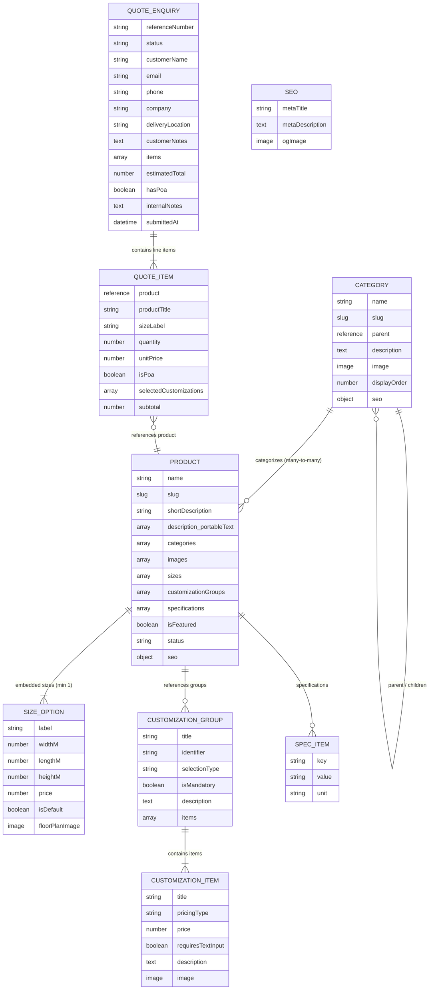

# Sanity Schemas Architecture & ERD

This document outlines the content architecture, relations, and entity-relationship diagram for the Karmod International Sanity CMS.

## Entity Relationship Diagram (ERD)

## Schema Entities

### 1. `category` (Document)
- **Hierarchy**: Self-referencing `parent` field enables multi-level taxonomy (Top-level -> Subcategory -> Sub-subcategory).
- **Display Order**: Integer field for ordering in navigation and category lists.
- **SEO**: Page title & meta description override for category pages.

### 2. `product` (Document)
- **Multi-Category**: Can belong to multiple categories/subcategories.
- **Mandatory Sizes**: At least one `sizeOption` is required. Units are in meters (`widthM`, `lengthM`, `heightM`), frontend handles dual metric/imperial display.
- **Customizations**: References `customizationGroup` documents (Electricity, Heater, WC, Kitchen).
- **Rich Description**: Block content (Portable Text) supporting headers, bold/italic, lists, and links.
- **Specs**: Key-value pairs for technical specifications.

### 3. `customizationGroup` (Document)
- Reusable add-on groups (e.g., Electricity Options, Heater Options, Sanitation / WC, Kitchenette).
- `selectionType`: `'single'` (radio), `'multiple'` (checkbox), or `'boolean'` (toggle).
- `items`: Array of `customizationItem` objects.

### 4. `customizationItem` (Object)
- Choice within a group.
- `pricingType`:
  - `fixed`: Fixed additional price (£).
  - `included`: Standard / included at £0.
  - `poa`: Price on Application (triggers custom quote logic).
- `requiresTextInput`: Flag for user notes (e.g., custom electrical requirements).

### 5. `sizeOption` (Object)
- Metric dimensions (`widthM`, `lengthM`, `heightM`), explicit price (£), default selection flag, and optional floor plan / 2D diagram.

### 6. `quoteEnquiry` (Document - Lead CRM)
- Stored directly in Sanity when visitors submit the quote form.
- `status`: `'new'` (unread) ➔ `'in_progress'` (contacted) ➔ `'quote_sent'` ➔ `'won'` ➔ `'lost'`.
- `internalNotes`: Internal followup and negotiation notes for the Karmod sales team.
