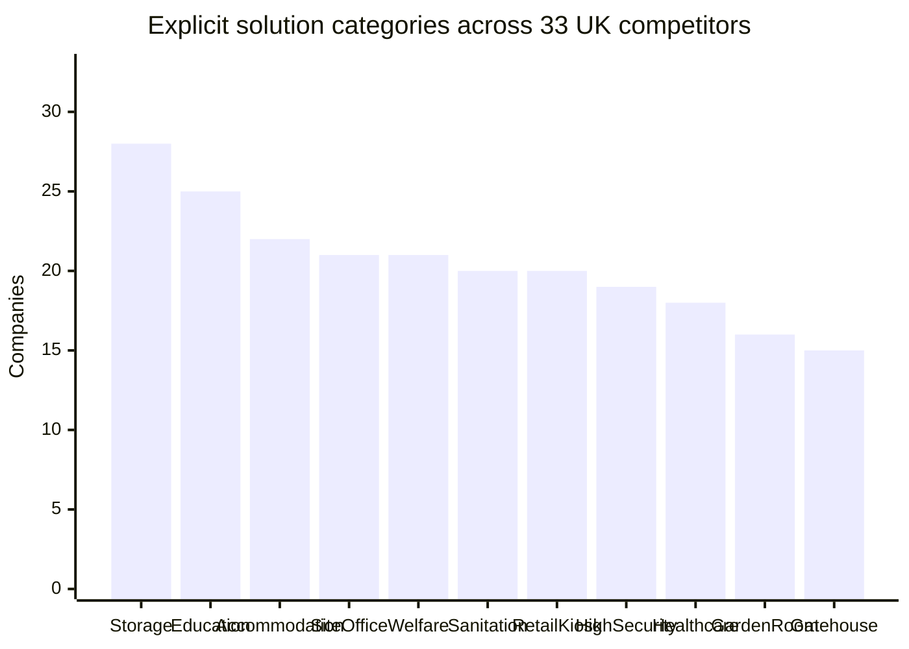
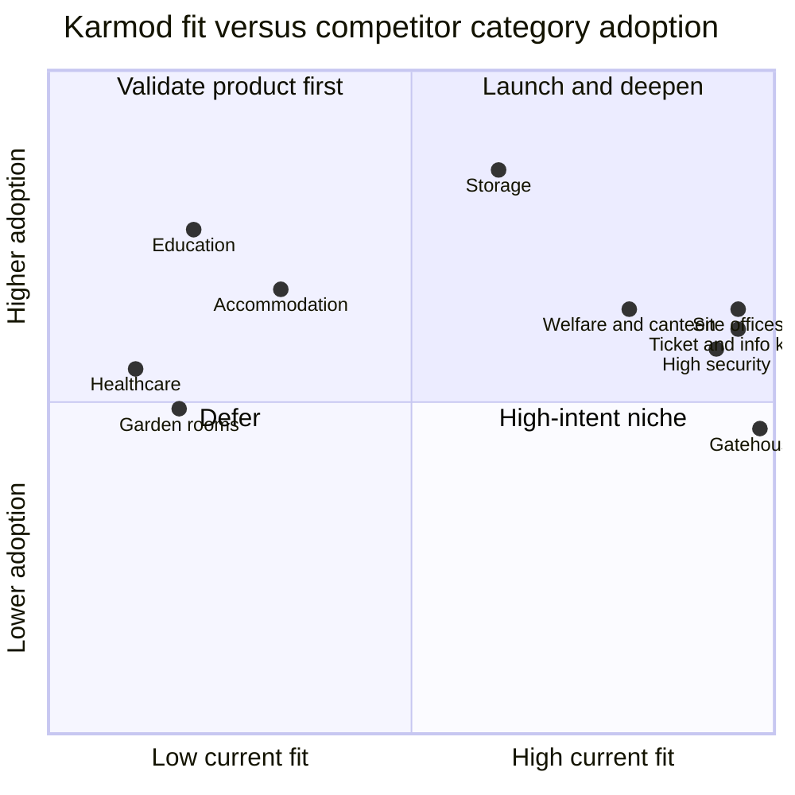
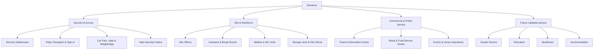

# UK solutions-page competitor research for Karmod International

**Research date:** 16 September 2026  
**Geography:** United Kingdom  
**Competitive sample:** 33 unique companies, across three purposive research slices  
**Evidence base:** Current first-party company pages, company-hosted brochures/case studies, Karmod repository data, HSE and GOV.UK guidance  
**Data file:** [33-company CSV](./2026-09-16-uk-solutions-competitor-landscape.csv)  
**Detailed evidence appendices:** [container and portable suppliers](./solutions-competitors-containers.md) · [commercial modular suppliers](./solutions-competitors-modular.md) · [garden and specialist suppliers](./solutions-competitors-garden-specialist.md)

## Executive decision

Build the Solutions section around **customer jobs**, not Karmod's construction materials. Keep GRP, sandwich panel, composite, portable cabin and bullet-resistant construction as product filters or recommended products inside each solution.

Launch these pages first:

1. **Site Offices**
2. **Security Gatehouses & Access Control**
3. **Ticket, Information & Service Kiosks**
4. **Canteens & Break Rooms**
5. **Welfare & WC Units**
6. **Storage Units & Site Stores**
7. **High-Security Cabins** — only after protection and certification claims are verified

Create supporting use sections for **visitor reception/sign-in**, **car parks and valet points**, **events and venues**, **industrial/logistics entrances**, and **retail/food-service kiosks**. These can reuse the seven core page templates and product mappings.

Do **not** launch Garden Rooms, Classrooms, Healthcare Buildings or Accommodation Units as fully supported solution pages yet. Competitors use those categories heavily, but current Karmod repository evidence does not establish the residential finish, accessibility, fire, acoustic, clinical, occupancy or habitable-building performance those buyers expect. Keep them in a validated roadmap until specifications and project proof exist.

## Headline findings

- The research found **33 unique UK-market competitors** and reviewed more than 100 first-party URLs. Two firms, Algeco and Wernick, occurred in both container and commercial-modular research slices and were counted once in the consolidated data.
- **Use-led navigation is the norm.** Competitors expose concrete outcomes—office, canteen, gatehouse, classroom, clinic, kiosk, annexe—not only product construction.
- In the consolidated sample, explicit categories appear most often for **storage (28/33)**, **education (25/33)**, **accommodation (22/33)**, **site office (21/33)**, **welfare/canteen (21/33)**, **sanitation (20/33)** and **retail/ticket/information (20/33)**.
- Segment context matters. All 11 container/portable suppliers reviewed explicitly market office, welfare/canteen, sanitation, storage, retail/ticket/information and industrial/high-security uses. All 12 commercial-modular suppliers market education and welfare/canteen. Eleven of 12 lifestyle specialists market a garden-room/office use.
- Karmod currently has **6 product families and 32 size variants**, spanning footprints from **1.10m × 1.10m to 3.00m × 7.00m**. Five product families are compact gatehouse/kiosk or security ranges; one is a larger portable cabin.
- Current customization supports **electricity, heating and air conditioning** across the compact cabin families. The larger Portable Cabin also supports **WC and kitchenette** configurations.
- Current catalogue evidence strongly supports gatehouse, kiosk, site-office, canteen/break-room, welfare/WC, storage and high-security positioning. It does not yet support generic claims such as “fully compliant classroom,” “clinical building,” “habitable garden annexe,” or “planning permission not required.”

## 1. What Karmod can sell now

Repository evidence used:

- [Catalogue manifest](../../sanity/catalogue/manifest.json): five cabin/security product families and 28 size variants.
- [Portable Cabin product script](../../scripts/manual-products/add-container-products.ts): one larger family and four size variants.
- [Top-level category seeds](../../sanity/seeds/categories.ndjson): **Portable Cabins** and **Gatehouses & Kiosks**.
- [Customization groups](../../sanity/seeds/customizationGroups.ndjson): electricity, kitchenette, WC, heater and air conditioning.
- [Product customization recipes](../../scripts/customizations/lib/seedRecipes.ts): compact-cabin and portable-cabin option availability.
- Product-use copy: [GRP](../../sanity/catalogue/copy/grp-cabin.md), [Insulated Panel](../../sanity/catalogue/copy/insulated-panel-cabin.md), [MetroCity](../../sanity/catalogue/copy/metrocity-modular-cabin.md), [KompoCity](../../sanity/catalogue/copy/kompocity-composite-cabin.md), [Bulletproof Security Cabin](../../sanity/catalogue/copy/bulletproof-security-cabin.md).

### Catalogue baseline

| Product family | Variants | Size range | Current explicit uses | Available customization groups |
|---|---:|---|---|---|
| GRP Cabin | 5 | 1.50 × 1.50m–2.70 × 2.70m | Security/control; car park/valet; site office; events; ticket control; sales/service kiosk | Electricity; heater; air conditioning |
| Insulated Panel Cabin | 5 | 1.10 × 1.10m–2.60 × 2.60m | Security/control; reception; visitor control; car park/valet; construction/logistics; events | Electricity; heater; air conditioning |
| MetroCity Modular Cabin | 5 | 1.40 × 1.40m–2.65 × 2.65m | Residential/commercial entrances; reception; campuses; logistics/industrial; public service; tickets/information; kiosks | Electricity; heater; air conditioning |
| KompoCity Composite Cabin | 5 | 1.40 × 1.40m–2.65 × 2.65m | Gatehouse; information/reception; valet; sales office; ticket/service/catering kiosk | Electricity; heater; air conditioning |
| Bulletproof Security Cabin | 8 | 1.50 × 1.50m–3.00 × 5.00m | Custodial/judicial; diplomatic; critical infrastructure; ports/airports/borders; banking; defence; events | Electricity; heater; air conditioning |
| Portable Cabin | 4 | 2.30 × 6.00m–3.00 × 7.00m | Site office; storage; welfare; break room | Electricity; heater; air conditioning; WC; kitchenette |
| **Total** | **32** | **1.10 × 1.10m–3.00 × 7.00m** | Two existing top-level categories | Five groups in repository |

### Solution-to-product map

| Proposed solution | Best current product mapping | Configuration story | Evidence status |
|---|---|---|---|
| Security Gatehouses & Access Control | GRP; Insulated Panel; MetroCity; KompoCity; Bulletproof Security | Lighting/sockets; heat; AC; size by staffing/equipment | **Strong now** |
| Ticket, Information & Service Kiosks | GRP; MetroCity; KompoCity | Electricity; heat/AC; counter/opening requirements need enquiry | **Strong now**, but counter layouts need proof |
| Site Offices | Portable Cabin; larger Panel/GRP/MetroCity/KompoCity variants for single-person posts | Electrical layout; heat/AC; optional WC/kitchen in Portable Cabin | **Strong now** |
| Visitor Reception & Sign-in | Panel; MetroCity; KompoCity; Portable Cabin | Visibility; desk/equipment; heat/AC | **Strong now** |
| Canteens & Break Rooms | Portable Cabin | Kitchenette; electrical; heat/AC; optional WC | **Supported**, needs capacity/layout proof |
| Welfare & WC Units | Portable Cabin | WC; kitchenette; electrical; heat/AC | **Supported**, but HSE-complete welfare claim needs exact layout |
| Storage Units & Site Stores | Portable Cabin | Plain or office/store layout; security specification needs definition | **Supported** |
| Car Park / Valet / Weighbridge | GRP; Panel; MetroCity; KompoCity | Desk; power; climate control; visibility | **Strong now** |
| High-Security Cabins | Bulletproof Security Cabin | Project-specified protection; equipment; long-shift fit-out | **Product exists**, certification claims need verification |
| Garden Rooms / Garden Offices | No dedicated residential product in repository | Would need finish, glazing, foundation, acoustic/thermal and planning offer | **Roadmap** |
| Classrooms / Education Rooms | Portable Cabin is physically adjacent, not education-proven | Would need occupancy, fire, ventilation, acoustic, accessibility and sanitation evidence | **Roadmap** |
| Healthcare / Consultation Rooms | No clinical specification in repository | Would need hygiene, clinical services, accessibility and compliance evidence | **Do not publish yet** |
| Accommodation / Annexes | Category copy mentions accommodation, but no dedicated sleeping/habitable layout is evidenced | Would need habitable specification, sanitary layout, fire/energy evidence | **Roadmap** |

## 2. Research design and evidence boundary

### Sample construction

Three independent competitor slices were researched:

| Research slice | Companies | Primary purpose |
|---|---:|---|
| Container conversions, portable cabins and site accommodation | 11 | Find operational uses and conversion vocabulary closest to the Portable Cabin |
| Commercial modular/prefabricated suppliers | 12 | Find sector navigation, enterprise procurement and larger-building solution labels |
| Garden rooms, cabins and specialist outdoor rooms | 12 | Test garden-room language, consumer uses, annexes and specialist kiosk/gatehouse positioning |
| Duplicate firms across slices | 2 | Algeco and Wernick appeared in two slices |
| **Unique consolidated competitors** | **33** | Used for the CSV and overall frequency chart |

Selection was purposive, not random. Results describe **competitor website taxonomy**, not UK market share, revenue or keyword volume.

### Coding rule

Each company received 11 binary tags. `1` means a current first-party company page explicitly names the product/use or directly documents it in a company-hosted project. `0` means evidence was not found in this pass; it does not prove technical inability.

For duplicated companies, the consolidated row uses the union of verified first-party evidence. In practice, Algeco and Wernick had the same tag values in both research slices.

### Normalized definitions

| Tag | Counted evidence |
|---|---|
| `site_office` | Construction, project or operational site office—not a generic commercial office alone |
| `welfare_canteen` | Welfare, canteen, mess, break, changing or drying provision |
| `sanitation` | WC, toilet, shower, washroom or ablution provision |
| `storage` | Storage room/container, secure store, equipment store, shed or workshop storage |
| `security_gatehouse` | Gatehouse, guard/security cabin, security lodge, access-control or CCTV post |
| `retail_ticket_info` | Retail, café/bar, kiosk, reception, ticket, information, visitor or marketing unit |
| `education` | Classroom, school, nursery, training/teaching or education sector |
| `healthcare` | Clinic, ward, health facility, clinical/non-clinical healthcare or therapy/treatment room |
| `accommodation` | Sleeping, living, residential, annexe, lodge or workforce/student accommodation; “site accommodation” alone does not qualify |
| `garden_room_office` | Garden room, garden office, home office or outdoor studio workspace |
| `high_security_industrial` | Anti-vandal, defence, ballistic, chemical, plant/energy or security-critical industrial use |

## 3. Quantified competitor findings

### Consolidated explicit-category adoption

| Rank | Normalized category | Companies | Share of 33 |
|---:|---|---:|---:|
| 1 | Storage / secure store / workshop storage | 28 | 84.8% |
| 2 | Education / classroom / training | 25 | 75.8% |
| 3 | Accommodation / living / annexe / sleeper | 22 | 66.7% |
| 4= | Site office | 21 | 63.6% |
| 4= | Welfare / canteen / break / changing | 21 | 63.6% |
| 6= | Sanitation / toilets / showers | 20 | 60.6% |
| 6= | Retail / ticket / information / reception | 20 | 60.6% |
| 8 | High-security / industrial | 19 | 57.6% |
| 9 | Healthcare / treatment | 18 | 54.5% |
| 10 | Garden room / garden office | 16 | 48.5% |
| 11 | Security gatehouse / access control | 15 | 45.5% |



**Interpretation:** High frequency proves a category is normal competitor language; it does not prove Karmod should publish it. Product fit and evidence readiness decide launch priority.

### Segment contrast

The most useful patterns come from each slice, not the blended total:

```text
CONTAINER / PORTABLE SUPPLIERS (n=11)
Site office              11  ███████████ 100%
Welfare/canteen          11  ███████████ 100%
Sanitation               11  ███████████ 100%
Storage                  11  ███████████ 100%
Retail/ticket/info       11  ███████████ 100%
High-security/industrial 11  ███████████ 100%
Education                10  ██████████░  91%
Gatehouse                 8  ████████░░░  73%
Healthcare                7  ███████░░░░  64%
Accommodation             6  ██████░░░░░  55%
Garden room/office        4  ████░░░░░░░  36%

COMMERCIAL MODULAR SUPPLIERS (n=12)
Welfare/canteen          12  ████████████ 100%
Education                12  ████████████ 100%
Site office              11  ███████████░  92%
Sanitation               11  ███████████░  92%
Storage                  11  ███████████░  92%
Healthcare               11  ███████████░  92%
Accommodation            10  ██████████░░  83%
Retail/ticket/info       10  ██████████░░  83%
High-security/industrial  9  █████████░░░  75%
Gatehouse                 8  ████████░░░░  67%
Garden room/office        1  █░░░░░░░░░░░   8%

GARDEN / SPECIALIST SUPPLIERS (n=12)
Office/workspace          12  ████████████ 100%
Gym/wellbeing             11  ███████████░  92%
Studio/creative           11  ███████████░  92%
Entertainment/social      10  ██████████░░  83%
Outdoor living/shelter    10  ██████████░░  83%
Client-facing business     9  █████████░░░  75%
Accommodation/living       8  ████████░░░░  67%
Storage/workshop           8  ████████░░░░  67%
Education                  5  █████░░░░░░░  42%
Gatehouse/ticketing        1  █░░░░░░░░░░░   8%
```

### Fit versus competitor adoption

The horizontal axis below is an analyst assessment of current Karmod catalogue fit. Vertical position uses the 33-company category count. It is a prioritization aid, not demand forecasting.



## 4. Competitor landscape: 33 companies

The company name links to the official UK-market site. Exact evidence pages and complete source notes live in the three detailed appendices and CSV.

| # | Company | Segment | Explicit solution language observed | Delivery model observed |
|---:|---|---|---|---|
| 1 | [S Jones Containers](https://www.sjonescontainers.co.uk/) | Container conversion | Offices; welfare; sanitation; canteens; gatehouses; classrooms; kiosks; laboratories; plant/energy | Sale; hire; bespoke; nationwide installation |
| 2 | [Cleveland Containers](https://www.clevelandcontainers.co.uk/) | Container conversion | Offices; drying; toilets; canteens; workshops; cafés/bars/kiosks; training; switchgear | Sale; hire; bespoke; UK delivery |
| 3 | [Portable Space](https://www.portablespace.co.uk/) | Container/portable | Offices; welfare; café/retail; garden room; education; health; gatehouse; plant | Buy; hire; standard/bespoke; HIAB installation |
| 4 | [Lion Containers](https://www.lioncontainers.co.uk/) | Container conversion | Office; welfare; canteen; sanitation; classroom; food/retail; visitor centre; garden office | Sale; custom build; national delivery |
| 5 | [Willbox](https://www.willbox.co.uk/) | Container/portable | Office; welfare; sanitation; gatehouse; retail/ticket/reception; sleeping; defence/medical | Hire; sale; fit-out; transport/lifting |
| 6 | [Adaptainer](https://adaptainer.co.uk/) | Container conversion | Offices; canteens; toilets; classrooms; shops; ticket offices; workshops; plant | Sale; hire; conversion; HIAB delivery |
| 7 | [Containers Direct](https://www.shippingcontainersuk.com/) | Container conversion | Offices; canteens; classrooms; garden offices; retail; catering; sanitation; pharmacy; plant | Sale; custom build; nationwide haulage |
| 8 | [Budget Shipping Containers](https://www.budgetshippingcontainers.co.uk/) | Container conversion | Office; welfare; sanitation; security hut; kiosk; café/bar; classroom; living; garden office | Sale; hire; conversion; crane delivery |
| 9 | [Algeco UK](https://www.algeco.co.uk/) | National modular/site | Site office; canteen; changing; sanitation; gatehouse; school; health; living; retail | Hire; permanent; used; turnkey |
| 10 | [Wernick Group](https://www.wernick.co.uk/) | National modular/site | Office; canteen; sanitation; gatehouse; classroom; clinic; retail; sleeper; workshop | Hire; sale; ex-hire; installation |
| 11 | [Cabinlocator](https://cabinlocator.co.uk/) | Portable/modular | Office; welfare; toilet; gatehouse; classroom; lab; health; retail; accommodation | Buy; hire; finance; made-to-brief |
| 12 | [Green Retreats](https://www.greenretreats.co.uk/) | Garden/lifestyle | Office; home business; studio; gym; bar; cinema; classroom; storage; annexe | Turnkey install; self-build option |
| 13 | [Cabin Master](https://www.cabinmaster.co.uk/) | Garden/lifestyle | Office; bar; gym; studio; school room; beauty room; spa; music room; lodge | Bespoke turnkey installation |
| 14 | [Garden Affairs](https://www.gardenaffairs.co.uk/) | Garden/lifestyle | Office; retreat; art; therapy; hobby; Airbnb/living; education; health | DIY; partial; turnkey |
| 15 | [Crane Garden Buildings](https://www.cranegardenbuildings.co.uk/) | Garden/lifestyle | Office; studio; summerhouse; gym; hobby/craft; entertainment | Made-to-order delivery/installation |
| 16 | [Crown Pavilions](https://www.crownpavilions.com/) | Garden/luxury | Office; gym; bar; music; games/cinema; pool; kitchen; annexe; guest room | Workshop-built; installed |
| 17 | [SMART Modular Buildings](https://www.smartgardenoffices.co.uk/) | Garden/lifestyle | Office; bar; games room; gym; therapy; salon; entertainment | Nationwide turnkey |
| 18 | [Booths Garden Studios](https://boothsgardenstudios.co.uk/) | Garden/lifestyle | Annexe; office; gym; retreat; shed; school room; commercial studio | Buy/rent; rapid installation |
| 19 | [Outside In Garden Rooms](https://www.outsideingardenrooms.co.uk/) | Garden/lifestyle | Gym; office; bar; cinema; storage; hobby; outdoor kitchen; multi-zone rooms | Managed bespoke build |
| 20 | [Dunster House](https://dunsterhouse.co.uk/) | Garden/DIY | Log cabin; office; salon; gym; games; bar; shed; garage; outdoor kitchen | DIY supply; UK delivery |
| 21 | [Keops](https://www.logcabins.co.uk/) | Timber/garden | Mobile home; garden room; education/commercial; office; sauna; workshop; gym | Bespoke design and UK install |
| 22 | [Bespoke Garden Homes](https://www.bespokegardenhomes.co.uk/) | Timber/custom | Home; annexe; guest house; lodge; workshop; office; treatment; hospitality; retail | Made-to-order; mainland delivery |
| 23 | [CMT Group](https://www.cmt.co.uk/) | Specialist security | Gatehouse; access control; event ticket/reception; car-park kiosk; induction office | Fully assembled; own-fleet delivery |
| 24 | [Portakabin](https://www.portakabin.com/gb-en/) | National modular/site | Education; site accommodation; health; office; storage; sanitation; hospitality; retail; housing | Buy; hire; pre-owned; turnkey |
| 25 | [Premier Modular](https://www.premiermodular.co.uk/) | National modular | Infrastructure; education; health; commercial; defence; justice; retail; residential | Rental; permanent; end-to-end |
| 26 | [Thurston Group](https://thurstongroup.co.uk/) | National modular | Construction; health; education; commercial; sport; residential; defence; gatehouse | Turnkey design-to-handover |
| 27 | [Modulek](https://modulek.co.uk/) | National modular | Education; sport; commercial; lodges; student rooms; community; welfare; security centre | Fixed-price bespoke turnkey |
| 28 | [TG Escapes](https://tgescapes.co.uk/) | Education/commercial | Education; health; garden buildings; classrooms; dining; nurseries; cafés; changing | Permanent turnkey design/build |
| 29 | [Integra Buildings](https://www.integrabuildings.co.uk/) | Commercial modular | Sport; education; office; retail/marketing; health; welfare; housing; anti-vandal | Turnkey; purchase/hire routes |
| 30 | [Actiform](https://actiform.co.uk/) | High-security modular | Healthcare; defence; nuclear; site accommodation; education; welfare; sleepers; ballistic/forensic | Buy/hire; permanent/temporary; bespoke |
| 31 | [Cotaplan](https://www.cotaplan.co.uk/) | Commercial modular | Healthcare; office; education; retail; leisure; canteen; changing; sanitation | New/refurbished; hire; turnkey |
| 32 | [Explore Modular](https://exploremodular.co.uk/) | Commercial modular | Site accommodation; education; office; health; events; welfare; storage; accommodation | Purchase; lease; rent; turnkey |
| 33 | [Cleveland Sitesafe](https://www.cleveland-sitesafe.co.uk/) | Secure/civic modular | Sport/changing; workshop; visitor centre; public toilet; kiosk/shop; site access; education | Bespoke manufacture and installation |

## 5. Vocabulary competitors use

### Stable buyer terms

| Buyer job | Strong UK-market labels | Avoid as sole label |
|---|---|---|
| Work on site | Site Office; Portable Office; Project Office; Office-Store | “Container” without function |
| Feed/rest workforce | Canteen; Mess Room; Break Room; Welfare Unit | “Accommodation” when no welfare fit-out exists |
| Hygiene/change | Toilet Block; Shower Block; WC Unit; Changing/Drying Room | “Welfare” for an empty room |
| Control access | Gatehouse; Security Cabin; Guard Hut; Security Lodge; Access-Control Cabin | Generic “Cabin” |
| Serve visitors | Reception; Sign-in Office; Visitor Check-in; Information Point | Generic “Office” |
| Sell/ticket | Ticket Booth; Retail Kiosk; Food Kiosk; Concession; Pop-up Shop | “Kiosk” without stated purpose where ambiguity matters |
| Store/protect | Secure Store; Site Store; Equipment Store; Storage Unit | “Depot” as product name |
| Industrial equipment | Plant Room; Switchgear House; Generator/Battery Enclosure; Control Room | “Bespoke Unit” without application |
| Live/sleep | Sleeper Unit; Worker Accommodation; Student Accommodation; Garden Annexe | “Site Accommodation,” which often means offices/welfare |
| Domestic extra room | Garden Office; Garden Room; Studio; Gym; Annexe | Industrial “site office” language |

### Important distinctions

- **Welfare unit** implies actual facilities. HSE says construction welfare includes toilets/washing plus changing, eating and rest areas. A bare cabin is not automatically a complete welfare solution. [HSE welfare overview](https://www.hse.gov.uk/construction/healthrisks/welfare/) · [HSE changing/eating/rest guidance](https://www.hse.gov.uk/construction/healthrisks/welfare/changing-rooms-and-lockers.htm)
- **Garden room** implies domestic finish and year-round comfort. Leading sellers specify glazing, insulation, internal finish, base, electrics and turnkey installation; annexes are separated as a higher-regulation product.
- **Gatehouse** implies staffed access control and clear sightlines. Competitors extend it into sign-in, reception, ticketing, barrier control, weighbridge and car-park operations.
- **High-security**, **bullet-resistant** and **anti-vandal** are not interchangeable. Publish only the protection level that documentation verifies.
- **Modular building** usually signals a joined/stacked or larger project system. **Portable cabin** fits a self-contained delivered unit. Keep both terms where scale differs.

## 6. Recommended information architecture



### Suggested URLs and launch order

| Phase | URL | Primary product relationship | Action |
|---|---|---|---|
| P0 | `/solutions/site-offices` | Portable Cabin; larger compact cabins | Launch |
| P0 | `/solutions/security-gatehouses` | GRP; Panel; MetroCity; KompoCity; Bulletproof | Launch |
| P0 | `/solutions/ticket-information-kiosks` | GRP; MetroCity; KompoCity | Launch |
| P1 | `/solutions/canteens-break-rooms` | Portable Cabin + kitchenette | Launch after capacity/layout proof |
| P1 | `/solutions/welfare-wc-units` | Portable Cabin + WC/kitchen | Launch after exact standard fit-out definition |
| P1 | `/solutions/storage-units` | Portable Cabin | Launch after lock/security and access options defined |
| P1 | `/solutions/high-security-cabins` | Bulletproof Security Cabin | Launch only with verified protection documentation |
| P2 | `/solutions/garden-rooms` | New or re-specified residential product | Hold |
| P2 | `/solutions/classrooms` | New education-ready product/layout | Hold |
| P2 | `/solutions/healthcare-buildings` | New compliant clinical/non-clinical offer | Hold |
| P2 | `/solutions/accommodation-units` | New habitable/sleeper layout | Hold |

### Page template

Every solution page should contain:

1. **Outcome-led H1:** “Portable Site Offices,” not “Sandwich Panel Structures.”
2. **One-sentence scope:** Who it serves, typical deployment, temporary/permanent boundary.
3. **Quick specification band:** Product family, size range, occupancy/capacity if verified, delivery state, available services.
4. **Recommended products:** Cards linking to exact family and compatible sizes.
5. **Configuration by task:** Standard, optional and project-specific features. State what is not included.
6. **Delivery/site requirements:** Base, access, crane/forklift, utilities, final connection, lead time and coverage—only when verified.
7. **Proof:** Project photos, location, unit count, floor area, programme and delivered fit-out.
8. **Compliance boundary:** Standards met, evidence document and what needs site-specific approval.
9. **FAQs:** Planning, foundations, power/water, relocation, maintenance and accessibility.
10. **Conversion CTA:** “Configure this solution,” “Request a layout,” and “Ask for delivery to [postcode].”

Do not duplicate product-page copy. Solution pages explain the buyer job and route visitors into compatible products/configurations.

## 7. Priority scoring

This heuristic prevents competitor popularity from overriding product truth.

Score components:

- **Current product fit: 40 points** — repository proves product can perform job.
- **Evidence readiness: 25 points** — current specifications, imagery and claims support publication.
- **Competitor adoption: 20 points** — normalized category count divided by 33.
- **Buyer specificity: 15 points** — category maps to a concrete purchase task.

| Solution | Product fit | Evidence | Adoption | Specificity | Score /100 | Decision |
|---|---:|---:|---:|---:|---:|---|
| Site Offices | 40 | 20 | 13 | 15 | **88** | P0 launch |
| Ticket, Information & Service Kiosks | 40 | 20 | 12 | 15 | **87** | P0 launch |
| Security Gatehouses & Access Control | 40 | 20 | 9 | 15 | **84** | P0 launch |
| High-Security Cabins | 40 | 10 | 12 | 15 | **77** | P1 after claim verification |
| Canteens & Break Rooms | 32 | 15 | 13 | 15 | **75** | P1 after layout/capacity proof |
| Welfare & WC Units | 32 | 10 | 12 | 15 | **69** | P1 after welfare specification |
| Storage Units & Site Stores | 24 | 15 | 17 | 12 | **68** | P1 after security/access specification |
| Accommodation Units | 16 | 5 | 13 | 15 | **49** | Roadmap |
| Classrooms | 8 | 5 | 15 | 15 | **43** | Roadmap; high market use, low current proof |
| Garden Rooms | 8 | 5 | 10 | 15 | **38** | Roadmap; separate domestic proposition needed |
| Healthcare Rooms | 8 | 0 | 11 | 15 | **34** | Hold; no clinical evidence |

Scores are analyst judgments from stated inputs, not sales forecasts.

## 8. Recommended copy direction

### Solutions hub hero

> **Portable building solutions for work, security and public service**  
> Choose by use, then compare compatible cabins, sizes and fit-out options. From compact gatehouses and kiosks to 7-metre site offices, canteens and welfare units.

### Card labels

- Security Gatehouses
- Site Offices
- Ticket & Information Kiosks
- Canteens & Break Rooms
- Welfare & WC Units
- Storage Units
- High-Security Cabins

### Product-selection language

Use three labels consistently:

- **Suitable now:** Current product and options directly support the use.
- **Configured to order:** Shell fits, but layout/openings/equipment require a project quote.
- **Specialist project:** Performance or compliance must be engineered and documented for the site.

This prevents a common competitor weakness: inspirational solution copy that never states which actual product, size or fit-out is suitable.

## 9. Content and evidence gaps

| Gap | Why it blocks trust/conversion | Evidence needed |
|---|---|---|
| Occupancy/capacity by layout | Buyers cannot choose size confidently | Approved layouts with desks/seats/fixtures and circulation |
| Standard versus optional equipment | “Ready to use” becomes ambiguous | Included-spec schedule for each family and solution |
| Delivery scope | Competitors sell deployment, not only shell | UK regions; crane/HIAB; unloading; siting; base; collection; exclusions |
| Utilities | WC/kitchen claims require service detail | Water, waste, power, final-connection responsibility |
| Welfare completeness | HSE welfare is broader than a toilet/kitchen toggle | Layouts covering required facilities for stated crew size and use |
| Protection level | “Bulletproof” is high-risk language | Test/certification document; threat level; glazing/door/wall scope |
| Fire/access/energy/acoustic performance | Needed for education, health and habitation | Product-specific certificates and design values |
| Garden-room finish | Domestic buyers expect a different product experience | Foundation, cladding, glazing, internal finish, heating, warranty and planning service |
| Case studies | First-party proof is central across leaders | Photos, client permission, location, problem, size, programme, fit-out, outcome |
| Lead times | Major conversion factor, but volatile | Operations-approved range and update owner/date |

Building approval and planning are separate. GOV.UK says Building Regulations cover construction/extension and advises checking with a building-control body; claims must remain project- and nation-specific. [GOV.UK building-regulations guidance](https://www.gov.uk/building-regulations-approval). Approved Document L also contains specific provisions for modular/portable buildings and their planned service life. [Approved Document L, Volume 2](https://assets.publishing.service.gov.uk/government/uploads/system/uploads/attachment_data/file/1133081/Approved_Document_L__Conservation_of_fuel_and_power__Volume_2_Buildings_other_than_dwellings__2021_edition_incorporating_2023_amendments.pdf)

## 10. Measurement plan

### Events to add before launch

| Event | Required parameters | Decision supported |
|---|---|---|
| `solution_view` | solution slug; sector; entry source | Which solution attracts qualified discovery |
| `solution_product_click` | solution; product; size shown; position | Which product mapping works |
| `solution_configure_start` | solution; product; selected size | Whether solution intent reaches configuration |
| `solution_option_select` | solution; option group; option | Which fit-outs drive demand |
| `solution_quote_start` | solution; product; size | Funnel entry |
| `solution_quote_submit` | solution; product count; POA flag | Conversion volume |
| `solution_contact_click` | solution; contact channel | Assisted-conversion demand |
| `solution_case_study_click` | solution; case study | Proof usage |

### Scorecard

Review per page:

- Organic impressions and non-brand query groups.
- Engaged sessions and product-card click-through.
- Configure-start rate.
- Quote-start and quote-submit rate.
- Qualified lead rate from CRM, not form volume alone.
- Most selected sizes/options by solution.
- Sales objections and missing-spec questions.
- Assisted conversions where a solution page precedes product/quote pages.

### Cadence

- **Weekly for first month:** tracking errors, zero-result paths, enquiries with missing solution/product attribution.
- **30 days:** early engagement and navigation correction; no ranking conclusions.
- **60 days:** query-to-page fit, product click-through, quote-start patterns.
- **90 days:** qualified-lead comparison; decide which P1 page to deepen.
- **Quarterly:** refresh competitor taxonomy, evidence claims, lead times, prices and regulations.

## 11. Verification checklist before publication

- [ ] Product owner confirms every recommended product/size relationship.
- [ ] “Standard” and “optional” fit-out lists match sellable configurations.
- [ ] Current customization seed prices are replaced or excluded from public claims where placeholders exist.
- [ ] Delivery coverage, unloading, siting, base and utility responsibilities are approved.
- [ ] Canteen/welfare capacity and layouts are documented.
- [ ] WC and kitchenette service requirements are documented.
- [ ] Bullet-resistant/protection terminology matches current certificates exactly.
- [ ] Fire, acoustic, thermal, ventilation and accessibility claims have named evidence.
- [ ] Planning and Building Regulations text is reviewed for England, Wales, Scotland and Northern Ireland scope.
- [ ] Case-study imagery has publication permission and truthful captions.
- [ ] Each page links only to available products and valid size options.
- [ ] Analytics events fire with solution, product and size identifiers.
- [ ] Search Console and sales-call language validate final H1/title wording before URL changes.

## 12. Limitations

- This is a deep taxonomy study, not a market-size, search-volume, pricing or market-share study.
- Company fleet, depot, coverage, speed and performance figures remain attributed company claims unless independently certified.
- Websites change. Recheck public comparative statements immediately before publication.
- Binary coding measures visible first-party evidence, not hidden capability.
- The combined 33-company sample intentionally spans different business models; overall percentages should not erase segment-specific differences.
- Competitor adoption shows normal buyer language. Karmod should publish only claims supported by its own product, delivery and compliance evidence.

## Conclusion

Karmod already has enough product breadth for a credible, focused Solutions launch. Best opportunity is not a huge “we build everything” catalogue. It is a compact, evidence-led system connecting seven buyer jobs to six real product families and 32 real sizes.

The market validates solution-led navigation. Karmod can differentiate by making the product relationship unusually clear: exact compatible families, sizes, available fit-out, delivery boundary and proof. Garden rooms, classrooms, healthcare and accommodation are real adjacent markets, but publishing them before product and compliance evidence exists would weaken trust.
